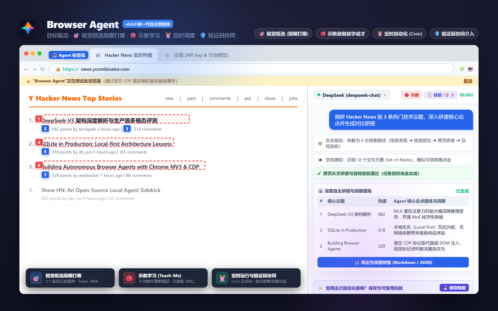
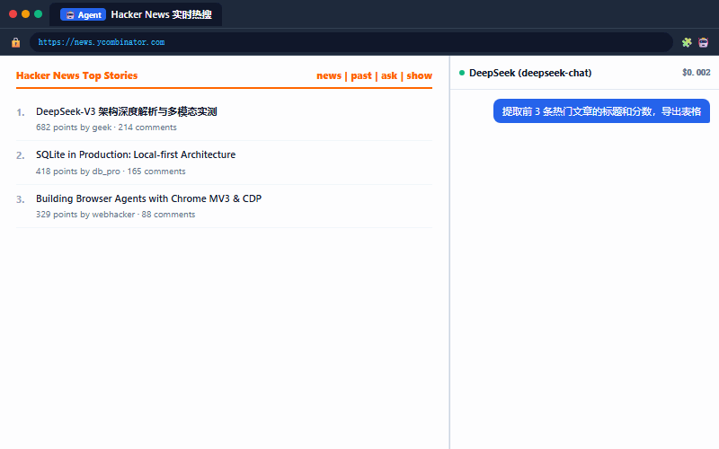
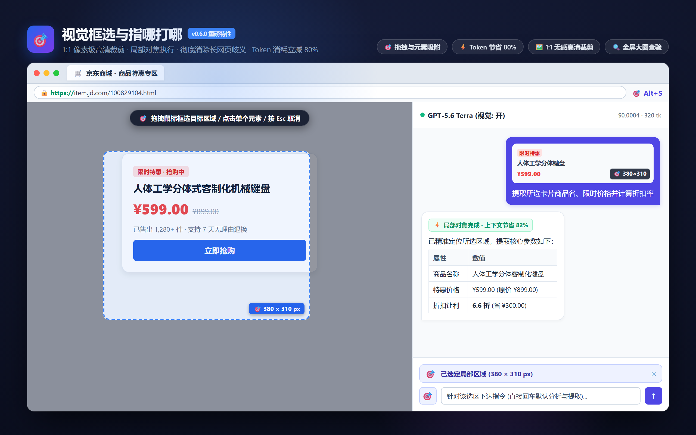
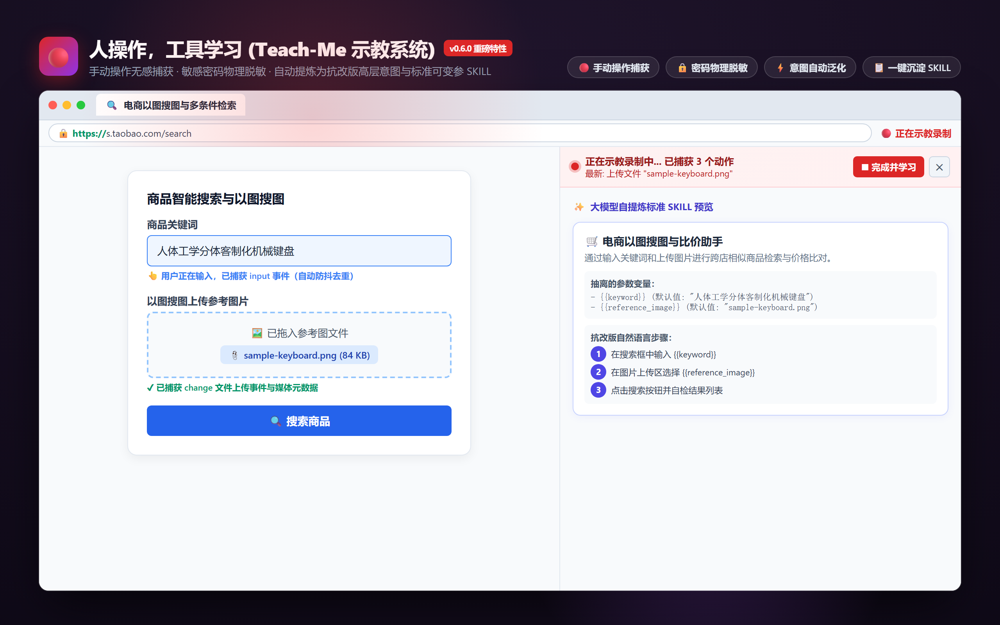
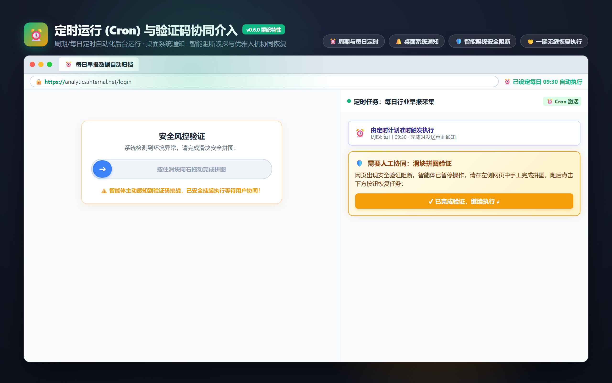
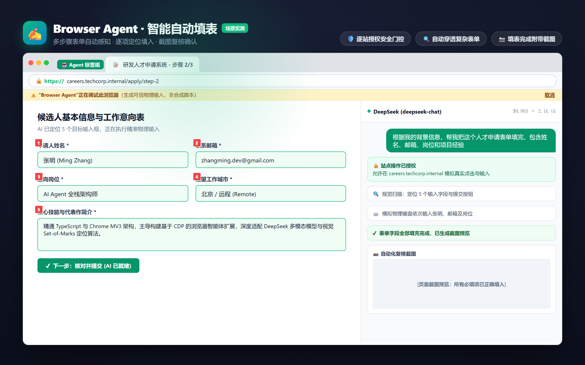

<p align="center">
  
</p>

<h1 align="center">Browser Agent</h1>

<p align="center">
  <strong>新一代自主 AI 浏览器智能体 · 个人专属的数字副驾驶</strong>
  <br>
  目标驱动 · 自主长程规划 · 视觉框选指哪打哪 · 示教学习 · 物理操控 · 结果自检闭环
  <br>
  <a href="README.md">English</a> · <a href="https://github.com/lusipad/browser-agent/releases">Releases</a> · <a href="PRIVACY.md">隐私政策</a>
</p>

<p align="center">
  <a href="https://chromewebstore.google.com/detail/browser-agent/ojkmgbmibnijmgiceoffgkioneohajak"></a>
  <a href="https://github.com/lusipad/browser-agent/releases"></a>
  <a href="LICENSE"></a>
  
  
</p>

---

**Browser Agent** 是一款直接运行在 Chrome 原生侧边栏中的**新一代自主浏览器智能体（Next-Gen Autonomous Browser Agent）**。它不仅仅是一个自动化脚本或爬虫插件，而是具备**认知、规划、多模态视觉感知、示教录制学习、物理级操控与自我纠错闭环**的完整数字助手。下达一个开放的目标，它会像资深人类专家一样，自主在纷繁复杂的现代 Web 应用中探索、执行并交付确定性结果。

<p align="center">
  
</p>

---

## 📸 核心特性画廊 (Feature Showcase)

<p align="center">
  
  <br>
  <em>🎯 视觉框选与指哪打哪：鼠标框选/点击吸附局部，1:1 高清无损裁剪，Token 消耗立减 80%，彻底消除长页歧义</em>
</p>

<p align="center">
  
  <br>
  <em>🔴 人操作，工具学习 (Teach-Me)：在浏览器中手工操作，后台无感静默捕获，大模型自提炼为可复用标准 SKILL</em>
</p>

<p align="center">
  
  <br>
  <em>⏰ 定时调度与验证码人机协同：Cron 周期/每日定时后台自动运行；遇到滑块/极验智能阻断主动挂起等待协同</em>
</p>

<p align="center">
  
  <br>
  <em>✍️ 复杂业务流自动化：原生 CDP 协议物理级击键，穿透 Shadow DOM 与复杂单页应用</em>
</p>

---

## 🚀 突破性智能体能力 (Agent Superpowers)

告别死板的单步指令，智能体以人类使用浏览器的方式自主理解并执行复杂使命：

- 🎯 **页面视觉框选与指哪打哪 (Visual ROI Selection & Point-and-Shoot)**：在输入框点击 `🎯` 或按快捷键 `Alt + S` 唤起全屏准星蒙层，支持拖拽矩形或点击单个元素吸附。后台通过 `OffscreenCanvas` 进行 1:1 像素级高清无损裁剪（**杜绝 Chrome CDP 黄色调试横幅警告**），直接对焦局部区域，**Token 消耗立减 70%~80%**，彻底解决复杂长页面、仪表盘卡片与多列信息流的定位歧义。
- 🔴 **人操作，工具学习 (Learning from Demonstration / Teach-Me 示教系统)**：点击「🔴 示教录制新技能」，用户直接在真实网页中点击、打字、跳转或上传文件。后台静默捕获操作流，密码框自动物理脱敏 (`******`)；录制完成后，大模型将物理动作自动泛化为抗改版的高层意图与抽取关键参数（如搜索词、上传文件），一键沉淀为标准 SKILL。
- ⏰ **定时调度与自动化运行 (Scheduled Skills / Cron)**：支持保存的技能按设定周期（15m / 30m / 1h / 6h / 12h / 24h）或每日固定时刻（如 09:30）在后台静默运行。基于 `chrome.alarms` 精准唤醒，执行完成后推送 Chrome 桌面系统通知，设置页提供清晰的运行状态与历史看板。
- 🛡️ **人机协同验证码介入 (Human-in-the-Loop Captcha)**：内置针对极验、滑块拼图、图形字符验证码、短信二次验证、Cloudflare Turnstile 的自动感知器。遇到安全阻断时主动安全挂起执行，弹出高亮呼吸光效协同卡片与系统通知；用户在网页验证通过后点击「已完成验证，继续执行」，智能体即刻无缝恢复。
- ⚡ **可复用 SKILL 技能沉淀与跨设备安全云同步**：任务完成后可一键沉淀为可重放的语义化 SKILL；基于 `chrome.storage.sync` 实现 Chrome 账号跨端实时同步，**API Key 默认在本地物理隔离（绝不上云）**，技能变量中的敏感 Token 自动净化。
- 🧠 **长程任务自主规划与自纠错闭环 (Autonomous Planning & Self-Correction)**：搭载 Planner + Actor + Validator 认知架构，`maxIterations` 执行上限放宽至 **500 步**，面对极长程复杂任务与大规模检索，自主将流程拆解为行动步骤并在每步动作后自校验收。
- 👁️ **原生系统级物理操控与空间视觉 (Native CDP & Spatial Grounding)**：通过 Chrome 官方 CDP 协议生成真实可信的物理鼠标点击与键盘事件（绕过合成 DOM 事件过滤器）；搭配 Set-of-Marks 视觉编号框，无惧复杂单页应用（SPA）、嵌套 Shadow DOM 与动态 iframe。
- 🔒 **纯正本地主权与安全防线 (Sovereign BYOK & Zero-Cloud)**：摆脱昂贵的月费 SaaS 绑架与云端隐私顾虑。直接连接 DeepSeek 官方 API、Claude、OpenAI 或本地离线 Ollama / vLLM。数据 100% 留在本机，内置逐站授权与金融黑名单拦截。

---

## 特性清单

- **🎯 视觉局部框选** — 拖拽框选 / 单击吸附，1:1 高清无损裁剪，Token 消耗压降 80%，支持全屏 Lightbox 大图预览
- **🔴 示教录制学习** — 手动操作无感捕获，击键防抖去重，密码脱敏，大模型自动泛化生成标准 SKILL
- **⏰ 定时调度运行** — 周期 / 每日定时自动执行，系统桌面通知，设置页状态反馈
- **🛡️ 验证码协同介入** — 智能嗅探极验/滑块/Turnstile/短信验证码，优雅挂起与一键恢复
- **以服务商为中心管理模型** — 接入 OpenAI / DeepSeek / OpenRouter / Ollama / vLLM / LM Studio…，通过 `/models` 发现模型并批量管理
- **同一模型支持多个 Endpoint** — 可通过不同服务商或网关使用同一个模型
- **密钥只存本机** — 默认保存在 `chrome.storage.local`，跨设备同步时敏感 Token 物理脱敏
- **逐站授权** — 每个域名首次操作前需明确批准
- **Set-of-marks** — 截图上叠加编号框，模型按编号精确定位元素
- **Shadow DOM / iframe 穿透** — 感知层深入开放 Shadow DOM 与同源 iframe
- **Planner + Validator** — 任务拆解为步骤 + 成功判据，长程执行上限提升至 500 步，完成时自检验收
- **Network-idle 等待** — 动作后等待页面加载 + 网络静默
- **可信 CDP 输入** — 通过 `chrome.debugger` 发送物理鼠标/键盘事件（非合成 DOM 事件）
- **实时成本追踪** — 逐模型计费、上下文占用进度条、累计成本显示
- **多会话历史** — 归档、切换、导出（Markdown / JSON）
- **中英双语界面** — 跟随浏览器语言或手动切换
- **标签组透明** — agent 操作过的标签归入蓝色「🤖 Agent」标签组

---

## 快速开始

```bash
npm install
npm run build        # 产物输出到 dist/
```

1. 打开 `chrome://extensions`，开启**开发者模式**
2. 点击**加载已解压的扩展程序**，选择 `dist` 目录
3. 首次安装自动打开设置页 — 填入 endpoint 和 API Key，点击**测试连接**
4. 点击工具栏图标打开**侧边栏**，选好模型，开始对话

> Base URL 可以带或不带末尾的 `/v1`（例如 `https://provider.example` 或 `https://provider.example/v1`）。**测试连接**用于验证 Endpoint，**同步模型**会读取 `/models`，随后可批量导入、启用、禁用或删除模型接入。
>
> 开发时用 `npm run watch` 监听 `src/`，改完刷新扩展即可。修改 `public/` 需重新 `npm run build`。

---

## 快捷键

| 快捷键 | 功能 |
|---|---|
| `Alt + S` | 快速激活网页视觉框选模式（🎯 指哪打哪） |
| `Esc` | 退出视觉框选模式 / 关闭大图预览 / 关闭抽屉面板 |
| `Enter` | 发送消息（选区挂载后直接回车默认解析提取该选区） |
| `Shift + Enter` | 在输入框中换行 |

---

## 安全模型

| 层级 | 机制 |
|---|---|
| 逐站授权 | 每域名弹审批卡片（仅本次 / 始终允许 / 拒绝） |
| 金融黑名单 | 银行、支付、交易所预置禁止 |
| 敏感确认 | 密码输入 / JS 执行 / 文件上传需逐次确认 |
| 示教隐私脱敏 | 录制时页面密码框（`type="password"`）输入强制脱敏为 `******` |
| 凭证物理隔离 | API Key 严格驻留本机存储，跨设备同步与技能导出时自动净化 |
| 反 prompt-injection | 系统提示声明页面内容为不可信数据，非指令 |
| `javascript_tool` 默认关闭 | 需在「高级」设置中显式开启 |
| 可见标识 | 蓝色「🤖 Agent」标签组 + Chrome 调试横幅 |
| 纵深防御 | 无 `externally_connectable`、隔离世界注入、发送方校验 |

---

## 架构

```
src/
  shared/          类型、设置、系统提示词、工具函数、i18n、技能存储与同步
    context.ts       上下文治理：token 估算 + 预算裁剪 + 成本核算
    skill.ts         SKILL 数据结构、变量模板解析、导出导入规范化
    syncStorage.ts   跨设备双层同步架构与本地密钥物理隔离
  providers/       OpenAI 兼容适配器（SSE 流式 + 历史格式转换）
  background/      Service Worker：智能体主循环、会话、权限、标签页
    cdp.ts           chrome.debugger 会话、截图、控制台/网络缓冲
    reader.ts        注入页面的自包含 DOM 感知函数（含反爬/验证码嗅探）
    regionSelector.ts 页面自包含视觉框选交互注入器（十字准星 + 元素吸附）
    recorder.ts      示教动作捕获注入器（点击、输入防抖、文件上传与密码脱敏）
    scheduler.ts     基于 chrome.alarms 的技能定时调度引擎与桌面通知
    skillGen.ts      大模型智能体轨迹提炼与示教动作流泛化引擎
    screenshot.ts    多分辨率 DPI 自动适配与 OffscreenCanvas 高清局部裁剪
    tools/           工具定义与分发（含 human 协同介入与站点授权门控）
    agent.ts         模型 ↔ 工具 迭代循环、多模态引导、上下文治理、Planner/Validator
    session.ts       每窗口会话控制（挂起/恢复、示教录制、持久化）
    history.ts       多会话归档到 chrome.storage.local
  sidepanel/       React 侧边栏：对话时间线、选区挂载、示教横幅、技能抽屉、大图预览
  options/         React 设置页：服务商、模型、技能全能编辑器 (Cron 配置)、安全同步、高级
```

---

## 工具集

| 工具 | 说明 |
|---|---|
| `tabs_context` / `tabs_create` / `tabs_close` | 列出 / 新建（归入 Agent 标签组）/ 关闭标签页 |
| `navigate` | 跳转 URL、后退/前进/刷新，等待加载并回传截图 |
| `computer` | 截图、点击、双击/右键、悬停、输入、按键组合、滚动、拖拽（CDP 物理模拟） |
| `read_page` / `find` | 提取可交互元素（稳定 ref、角色、坐标）/ 按文字定位 |
| `extract_data` | 结构化抽取：表格/链接/CSS selector+fields → JSON（穿透 shadow/iframe） |
| `form_input` | 按 ref 填表：input/textarea、select、复选/单选、contenteditable |
| `wait_for` | 轮询等待元素出现/消失/文本匹配（跨 frame 与 shadow DOM） |
| `get_page_text` | 提取全文（含 iframe），支持分页 |
| `scroll_to_ref` / `resize_window` / `screenshot` | 滚动到元素 / 调整窗口 / 主动截图 |
| `file_upload` | 从 URL 取文件并注入 file input 或模拟拖拽上传 |
| `request_human_intervention` | 遇到验证码、滑块拼图或短信二次验证时，主动安全挂起并请求人工协同 |
| `javascript_tool` | 在页面执行 JS（需用户逐次确认） |
| `read_console_messages` / `read_network_requests` | 读取控制台与网络日志 |
| `gif_creator` | 把对话截图帧导出为 GIF |

---

## 测试

```bash
npm test              # 全量测试：typecheck + 131 项单元测试 + E2E
npm run test:unit     # 纯逻辑单元测试（node:test）
npm run test:e2e      # 真实 Chromium 感知层测试（Playwright）
node scripts/test-region-e2e.mjs    # 视觉框选全链路 E2E 验证
node scripts/test-teach-me-e2e.mjs  # 示教录制学习全链路 E2E 验证
npm run bench         # 感知层基准评测（5 fixture，ground-truth 计分）
npm run bench:e2e     # 端到端 agent 评测（真实 LLM + Playwright + 本地 fixture）
```

完整验证流程参见 [docs/testing.md](docs/testing.md)。

---

## 文档导航

| 文档 | 说明 |
|---|---|
| [docs/releases/v0.6.0.md](docs/releases/v0.6.0.md) | **v0.6.0 重磅版本更新日志与发布说明** |
| [docs/releases/v0.5.1.md](docs/releases/v0.5.1.md) | v0.5.1 技能沉淀与安全云同步发布说明 |
| [docs/architecture.md](docs/architecture.md) | 详细架构设计、状态机与技术决策 |
| [docs/testing.md](docs/testing.md) | 扩展全链路手动与自动化验证协议 |
| [docs/store/submission.md](docs/store/submission.md) | Chrome Web Store 开发者上架与权限申报指南 |
| [docs/PROMOTION_GUIDE.md](docs/PROMOTION_GUIDE.md) | 推广与社区冷启动手册 |
| [docs/VIDEO_STORYBOARD.md](docs/VIDEO_STORYBOARD.md) | 短视频实操分镜与脚本 |
| [CHANGELOG.md](CHANGELOG.md) | 版本变更记录 |
| [PRIVACY.md](PRIVACY.md) | 隐私保护政策 |

---

## 已知限制

- 跨域 iframe 内部作为整块可点区域处理（文本可通过 `get_page_text` 读取）
- 无法自动化 `chrome://` 和 Web Store 内部管理页面
- 严禁且不会绕过金融支付密码；遇到安全验证码主动通过 `request_human_intervention` 挂起请求用户协同
- 部分强依赖逐键 keydown 的富文本编辑器对 `computer type` 无反应，改用 `form_input`

---

## 参考与致谢

技术思路参考：[browser-use](https://github.com/browser-use/browser-use)（DOM 序列化 + set-of-marks）、[Nanobrowser](https://github.com/nanobrowser/nanobrowser)（多智能体 Planner/Navigator/Validator）、[BrowserBee](https://github.com/parsaghaffari/browserbee)（扩展内 CDP 驱动）。未 fork 任何项目，实现独立编写。

---

## ⭐ Star History

[](https://star-history.com/#lusipad/browser-agent&Date)

---

## 许可证

MIT
