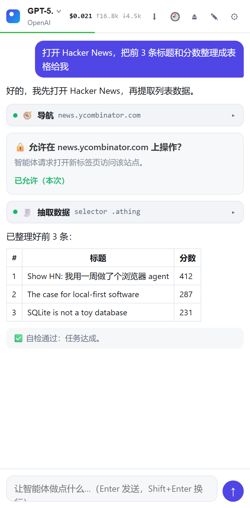
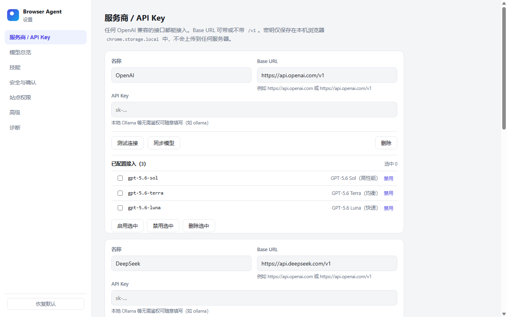

<p align="center">
  
</p>

<h1 align="center">Browser Agent</h1>

<p align="center">
  侧边栏 AI 浏览器智能体 — 接任意 OpenAI 兼容端点，密钥只存本机。
  <br>
  <a href="README.md">English</a> · <a href="https://github.com/lusipad/browser-agent/releases">Releases</a> · <a href="PRIVACY.md">隐私政策</a>
</p>

---

一个 Chrome 扩展（MV3）：在侧边栏用自然语言驱动浏览器。输入任务，AI 自动打开标签页、点击、填表、读取页面并汇报结果 — 用你自己的模型和 API Key。

<p align="center">
  
  &nbsp;&nbsp;
  
</p>

## 特性

- **任意 OpenAI 兼容模型** — OpenAI / DeepSeek / OpenRouter / Ollama / vLLM / LM Studio…
- **密钥只存本机** — 保存在 `chrome.storage.local`，不经任何中间服务器
- **逐站授权** — 每个域名首次操作前需明确批准
- **Set-of-marks** — 截图上叠加编号框，模型按编号精确定位元素
- **Shadow DOM / iframe 穿透** — 感知层深入开放 Shadow DOM 与同源 iframe
- **Planner + Validator** — 任务拆解为步骤 + 成功判据，完成时自检
- **Network-idle 等待** — 动作后等待页面加载 + 网络静默
- **可信 CDP 输入** — 通过 `chrome.debugger` 发送鼠标/键盘事件（非合成 DOM 事件）
- **实时成本追踪** — 逐模型计费、上下文占用进度条、累计成本显示
- **多会话历史** — 归档、切换、导出（Markdown / JSON）
- **中英双语界面** — 跟随浏览器语言或手动切换
- **标签组透明** — agent 操作过的标签归入蓝色「🤖 Agent」标签组

## 快速开始

```bash
npm install
npm run build        # 产物输出到 dist/
```

1. 打开 `chrome://extensions`，开启**开发者模式**
2. 点击**加载已解压的扩展程序**，选择 `dist` 目录
3. 首次安装自动打开设置页 — 填入 endpoint 和 API Key，点击**测试连接**
4. 点击工具栏图标打开**侧边栏**，选好模型，开始对话

> 开发时用 `npm run watch` 监听 `src/`，改完刷新扩展即可。修改 `public/` 需重新 `npm run build`。

## 安全模型

| 层级 | 机制 |
|---|---|
| 逐站授权 | 每域名弹审批卡片（仅本次 / 始终允许 / 拒绝） |
| 金融黑名单 | 银行、支付、交易所预置禁止 |
| 敏感确认 | 密码输入 / JS 执行 / 文件上传需逐次确认 |
| 反 prompt-injection | 系统提示声明页面内容为不可信数据，非指令 |
| `javascript_tool` 默认关闭 | 需在「高级」设置中显式开启 |
| 可见标识 | 蓝色「🤖 Agent」标签组 + Chrome 调试横幅 |
| 纵深防御 | 无 `externally_connectable`、隔离世界注入、发送方校验 |

## 架构

```
src/
  shared/          类型、设置、系统提示词、工具函数（前后台共用）
    context.ts       上下文治理：token 估算 + 预算裁剪 + 成本核算
    i18n/            轻量运行时 i18n，按区域拆分字典
  providers/       OpenAI 兼容适配器（SSE 流式 + 历史格式转换）
  background/      Service Worker：智能体主循环、会话、权限、标签页
    cdp.ts           chrome.debugger 会话、截图、控制台/网络缓冲
    reader.ts        注入页面的自包含 DOM 感知函数
    tools/           工具定义与分发（含站点授权门控、动作后自动截图）
    agent.ts         模型 ↔ 工具 迭代循环、上下文治理、Planner/Validator
    session.ts       每窗口会话，持久化到 chrome.storage.session
    history.ts       多会话归档到 chrome.storage.local
  sidepanel/       React 侧边栏：对话时间线、审批卡片、模型切换、历史抽屉
  options/         React 设置页：服务商、模型、安全、站点、高级
```

## 工具集

| 工具 | 说明 |
|---|---|
| `tabs_context` / `tabs_create` / `tabs_close` | 列出 / 新建（归入 Agent 标签组）/ 关闭标签页 |
| `navigate` | 跳转 URL、后退/前进/刷新，等待加载并回传截图 |
| `computer` | 截图、点击、双击/右键、悬停、输入、按键组合、滚动、拖拽（CDP） |
| `read_page` / `find` | 提取可交互元素（稳定 ref、角色、坐标）/ 按文字定位 |
| `extract_data` | 结构化抽取：表格/链接/CSS selector+fields → JSON（穿透 shadow/iframe） |
| `form_input` | 按 ref 填表：input/textarea、select、复选/单选、contenteditable |
| `wait_for` | 轮询等待元素出现/消失/文本匹配（跨 frame 与 shadow DOM） |
| `get_page_text` | 提取全文（含 iframe），支持分页 |
| `scroll_to_ref` / `resize_window` / `screenshot` | 滚动到元素 / 调整窗口 / 主动截图 |
| `file_upload` | 从 URL 取文件并注入 file input 或模拟拖拽上传 |
| `javascript_tool` | 在页面执行 JS（需确认） |
| `read_console_messages` / `read_network_requests` | 读取控制台与网络日志 |
| `gif_creator` | 把对话截图帧导出为 GIF |

## 测试

```bash
npm test              # typecheck + 单元 + E2E
npm run test:unit     # 纯逻辑单元测试（node:test）
npm run test:e2e      # 真实 Chromium 感知层测试（Playwright）
npm run bench         # 感知层基准评测（5 fixture，ground-truth 计分）
npm run bench:e2e     # 端到端 agent 评测（真实 LLM + Playwright + 本地 fixture）
```

完整手动验证协议见 [docs/testing.md](docs/testing.md)。

## 文档

| 文档 | 说明 |
|---|---|
| [docs/architecture.md](docs/architecture.md) | 详细架构与设计决策 |
| [docs/testing.md](docs/testing.md) | 扩展全链路手动验证协议 |
| [docs/store/](docs/store/) | Chrome Web Store 上架资料 |
| [CHANGELOG.md](CHANGELOG.md) | 版本历史 |
| [PRIVACY.md](PRIVACY.md) | 隐私政策 |

## 已知限制

- 跨域 iframe 内部作为整块可点区域处理（文本可通过 `get_page_text` 读取）
- 无法自动化 `chrome://` 和 Web Store 页面
- 不会也不应绕过验证码 / 反爬
- 部分强依赖逐键 keydown 的富文本编辑器对 `computer type` 无反应，改用 `form_input`

## 参考与致谢

技术思路参考：[browser-use](https://github.com/browser-use/browser-use)（DOM 序列化 + set-of-marks）、[Nanobrowser](https://github.com/nanobrowser/nanobrowser)（多智能体 Planner/Navigator/Validator）、[BrowserBee](https://github.com/parsaghaffari/browserbee)（扩展内 CDP 驱动）。未 fork 任何项目，实现独立编写。

## 许可证

MIT
